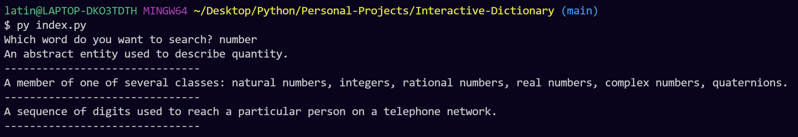

# Terminal Dictionary

## Description

Here is an application where a user can type a word and retrieve the definition of the word. If the user misspells a word, then the terminal provides the closest word that matches the user's input.

## Usage

To run the program, run this command in your terminal:

Windows:

```
$ py index.py
```

or

Mac:

```
$ python3 index.py
```

## Application


